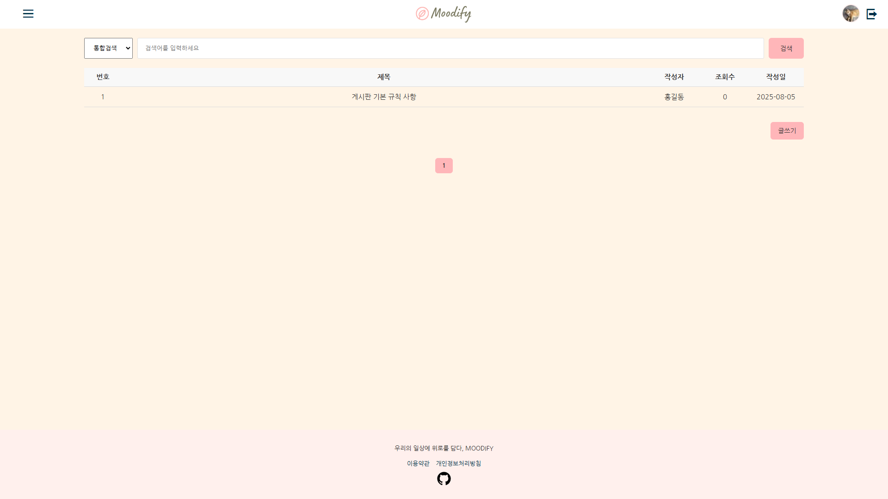

# Moodify
Mood + Modify = 일기를 통해 감정을 변화시키는 웹 서비스

> 감정 기반 일기장 & 음악 추천 웹 서비스

---

## 1. 프로젝트 개요

이 프로젝트는 사용자가 작성한 **일기 내용을 기반으로 감정을 분석**하고, 해당 감정에 어울리는 **음악을 추천**하는 웹 애플리케이션입니다. 감정 통계를 시각화하거나 월별로 일기 내역을 확인할 수 있는 **캘린더 기능**도 함께 제공하여, **감정 자기관리 및 회고**에 도움이 되는 플랫폼을 목표로 합니다.

**회원 전용 서비스**이며, 비회원은 회원가입 및 로그인을 통해 서비스를 이용할 수 있습니다. 회원 종류는 **일반 회원, 카카오 회원, 네이버 회원**이 있습니다. 또한 일반 회원의 경우에는 회원가입 시 **이메일 인증**을 요합니다. 회원가입 시에는 기본적인 회원 정보 외에 추가적으로 **프로필 등록, 약관 동의 항목**이 있습니다.

또한 사용자가 이용할 수 있는 **Q&A 게시판**과 관리자가 공지를 작성할 수 있는 **공지 게시판**이 존재합니다. 관리자는 게시판 자체를 관리(CRUD)할 수 있으며, 감정 결과 이미지 등을 등록/삭제할 수 있습니다.

---

## 2. 팀원별 역할 요약

| 👤 | 주요 담당 기능 | 기술 스택                                 |
|----|----------------|---------------------------------------|
| 김송미 | 마이페이지 | Java, Spring Boot, JavaScript, CSS |
| 안슬기 | 게시판, 댓글 기능 | Java, Spring Boot, JavaScript, CSS |
| 오다은 | 일기 CRUD, 음악 추천 | Java, Spring Boot, JavaScript, Python |
| 김용준 | 파일 공통 기능 전체, UI/UX | Java, Spring Boot, JavaScript, CSS |
| 최상준 | 로그인/회원가입 (이메일 인증) | Java, Spring Boot, JavaScript, CSS |

---

## 3. 기능별 설명 링크 및 사이트 캡쳐

- 🔐 [로그인/회원가입 기능](https://wave-bearberry-431.notion.site/2448accfef5380a0bbb7dda0d7c59641)
- 📘 [일기 CRUD 기능](https://wave-bearberry-431.notion.site/CRUD-2448accfef5380efb54dd22f23c12358)
- 🎶 [음악 추천 기능](https://wave-bearberry-431.notion.site/2448accfef53801dbcdedd8e56653563)
- 🙍‍♀️ [마이페이지](https://wave-bearberry-431.notion.site/2448accfef538083b363dc30f2f77a8b)
- 📎 [파일 공통 기능](https://wave-bearberry-431.notion.site/2448accfef53801f962dd05a041624db)
- 💬 [게시판 기능](https://wave-bearberry-431.notion.site/2448accfef5380a0afc9c8195754fa6f)
- 🎨 [UX/UI 디자인](https://wave-bearberry-431.notion.site/UX-UI-2448accfef538032b002d937fb14f9c0)

**[최상준]** - 회원가입/로그인

  
  

  
  

  
  

  
  

**[오다은]** - 일기 페이지 + 음악 추천 기능

  
  

    
    

  
  

  
  

**[김송미]** - 마이페이지

  
  

    
    

  
  

**[김용준]** - 파일 공통 기능(프로필 썸네일 등), 사이드 메뉴, 전반적인 CSS

  
  

**[안슬기]** - 게시판 기능

  
  

  

  
  

  
  

---

## 4. 사용 기술

### 언어
- **Java**
- **HTML (Thymeleaf)**
- **JavaScript**
- **CSS**
- **Python** (감정 분석 코드 – 레포지토리 외부)

### 백엔드 프레임워크 & 라이브러리
- **Spring Boot** – 전체 애플리케이션 프레임워크
- **Spring MVC** – 웹 요청 처리
- **Spring Data JPA** – ORM 기반 DB 접근
- **Hibernate** – JPA 구현체
- **QueryDSL** – 타입 안전한 동적 쿼리 생성
- **Lombok** – 반복 코드 생략 (`@Data`, `@Builder` 등)

### 유효성 검사 & JSON 처리
- **Jakarta Validation (JSR-380)** – `@Valid`, `@NotBlank` 등
- **Jackson** – `@JsonFormat`, JSON 직렬화/역직렬화

---

## 🎥 5. 발표 영상

[발표 영상 보러 가기]() <!-- 여기에 실제 영상 URL 삽입 -->

---
